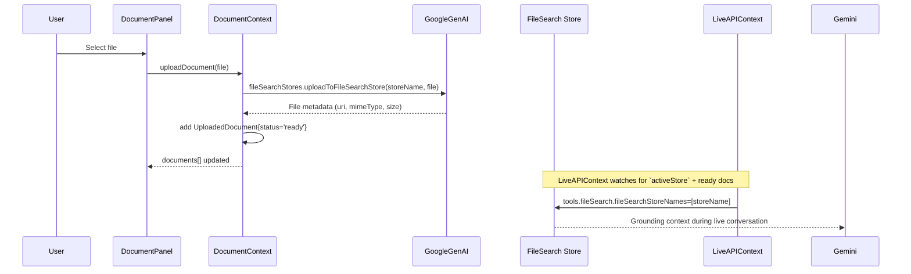

# JAN Architecture Overview

## 1. High-Level System Architecture

JAN (Just Another Neuralnet) is a browser-based overlay assistant built with React and the Gemini API. It runs as a single-page app and layers an intelligent UI on top of the user's screen while streaming multimodal context (screen pixels + audio + text) to Google's Gemini models.

```mermaid
flowchart LR
    User[User] -->|Screen Share, Voice, Text| UI[React UI (JAN)]

    subgraph Browser
        UI --> ScreenShare
        UI --> ChatWidget
        UI --> LiveAPIContext
        UI --> DocumentContext
        UI --> Services[Gemini Service Layer]
    end

    ScreenShare -->|displayMedia video stream| Video[Hidden Video Element]
    ScreenShare -->|Snipping events| Canvas[Hidden Canvas]

    Canvas -->|JPEG frames| LiveAPIContext
    LiveAPIContext --> GenAILiveClient

    GenAILiveClient -->|WebSocket (Live)| GeminiLive[Gemini 2.5 Flash Native Audio]
    Services -->|REST calls| GeminiHTTP[Gemini 2.5 Flash / Image / Veo]

    DocumentContext --> FileSearchStore[(File Search Store)]
    FileSearchStore --> GeminiLive
```

**Key flows:**
- **Live Loop:** ScreenShare + hidden canvas + LiveAPIContext stream low-FPS screen frames to Gemini Live.
- **Voice Loop:** AudioRecorder + LiveAPIContext send microphone audio to Live API and play back Gemini audio via AudioStreamer.
- **Chat / Gen Loop:** App uses `services/geminiService.ts` for text chat, image generation, and video generation.
- **RAG Loop:** DocumentContext creates and populates a File Search Store; LiveAPIContext attaches it as a tool for live sessions.

## 2. Core Modules and Responsibilities

### 2.1 App.tsx
- Bootstraps the application UI and context providers.
- Wraps the app in `DocumentProvider` and `LiveAPIProvider`.
- Coordinates layering:
  - **ScreenShare**: background screen feed.
  - **ChatWidget**: foreground overlay for interaction.
  - **LandingPage**: cinematic intro that transitions into the main app.
- Implements the **screen perception loop** via `useScreenCapture` hook:
  - Uses frame diffing to skip frames with >92% similarity to the previous frame.
  - Adaptive FPS: ~750ms interval during activity, ~2000ms when idle (no user input for 3s).
  - Configurable JPEG quality (default 0.75, or content-adaptive).
  - Only sends changed frames to Live API as `image/jpeg`.
- Routes messages between Gemini (Live + HTTP) and the chat history.

### 2.2 components/ChatWidget.tsx
- Primary interaction surface for JAN.
- Modes via `ViewMode`:
  - `WIDGET`: small launcher button (`JAN` pill) in the corner.
  - `EXPANDED`: full overlay window with header, content, and footer.
- Pages inside expanded mode:
  - **Page 0  Chat**: conversation transcript, multimodal messages, attachments.
  - **Page 1  Whiteboard**: drawing canvas via `WhiteboardPanel`.
  - **Page 2  Knowledge Base**: document management via `DocumentPanel`.
- UX behaviours:
  - Resizable from the top-left handle.
  - Draggable by header and main content (with safeguards around buttons/inputs).
  - Swipe navigation across pages using horizontal drag.
  - **Edge Navigation Bars**: slick left/right bars that appear near the vertical middle edges and navigate pages when clicked.
  - Click-outside-to-minimize using a `pointerdown` listener on `document`.
- Live integration:
  - Uses `useLiveAPI()` to read status, connect/disconnect, and audio recording state.
  - **Go Live Mic Button**: if disconnected, clicking Mic calls `connect()`; on connection, the LiveAPIContext auto-starts recording.

### 2.3 components/ScreenShare.tsx
- Handles `navigator.mediaDevices.getDisplayMedia` for screen capture.
- Manages lifecycle of the screen stream and passes it back to `App.tsx` via callbacks.
- When snipping is active:
  - Renders an overlay over the video.
  - Lets the user drag a rectangle.
  - Projects the rectangle coordinates back to the video's source resolution.
  - Captures the region into a canvas and produces a base64 JPEG.

### 2.4 components/WhiteboardPanel.tsx
- Provides a rich whiteboard experience:
  - Tools: pen, brush, eraser, rectangle, circle, line.
  - Adjustable stroke width and color palette.
  - Undo and clear canvas actions.
- Maintains strokes in React state but uses refs during drawing to avoid render thrash.
- Can export the current canvas as base64 (`onCaptureImage`) so ChatWidget can use sketches as visual context.

### 2.5 components/DocumentPanel.tsx
- UI for managing RAG documents:
  - Shows list of `UploadedDocument` with size, status (`indexing`, `ready`, `failed`), and error where relevant.
  - Allows uploading new documents (PDF, TXT, MD, CSV).
  - Allows deleting documents from the local list.
- Uses `useDocumentContext()` to:
  - Call `uploadDocument(file)`.
  - Reflect `isUploading`, `error`, and `activeStore` status.

### 2.6 contexts/DocumentContext.tsx
- Owns the document / File Search Store lifecycle.
- On mount:
  - Lazily creates a new File Search Store via `ai.fileSearchStores.create`.
  - Stores `{ name, displayName, documentCount, totalSizeBytes }` as `activeStore`.
- `uploadDocument(file, options?)`:
  - Requires an API key; if missing, records an error.
  - Uses `ai.fileSearchStores.uploadToFileSearchStore(...)` to both upload the file and index it into the active store.
  - Supports optional `UploadOptions`: `displayName`, `metadata[]`, `chunkingConfig`.
  - Builds an `UploadedDocument` record with `documentName` for deletion.
  - Performs optimistic stats update, then refreshes from API.
- `deleteDocument(documentName)`:
  - Calls `DELETE v1beta/{documentName}` API.
  - Tolerates 404s (already deleted).
  - Optimistically updates store stats.
- Enhanced features:
  - `stores[]`: array of all stores (supports multi-store management).
  - `listStores()`, `createStore(displayName)`, `deleteStore(storeName)`, `selectStore(store)`.
  - `refreshStore()`: fetches latest stats from API.
  - `settings` / `updateSettings()`: RAG display settings (e.g., `displayCitations`) persisted to localStorage.
- Exposes:
  - `documents`, `activeStore`, `stores`, `uploadDocument`, `deleteDocument`, `isUploading`, `error`
  - `refreshStore`, `listStores`, `createStore`, `deleteStore`, `selectStore`
  - `settings`, `updateSettings`

### 2.7 contexts/LiveAPIContext.tsx
- Wraps the Gemini Live API via `GenAILiveClient`.
- Manages connection status (`LiveStatus`): `disconnected`, `connecting`, `connected`, `error`.
- Builds a `LiveConfig` on every change of `activeStore` / `documents`:
  - **Mutually exclusive tools**: Uses `fileSearch` when RAG documents are ready, otherwise `googleSearch`.
  - Sets model to `models/gemini-2.5-flash-native-audio-preview-09-2025` with voice `Aoede`.
- Event handlers:
  - `open`: sets `status='connected'` and calls `startRecording()`.
  - `close`: sets `status='disconnected'` and stops recording.
  - `content`: receives audio parts from the model; passes PCM16 to `AudioStreamer` for playback.
  - `textDelta`: accumulates streaming transcript text.
  - `turnComplete`: finalizes the turn and emits `lastCompletedTurn`.
- Exposes:
  - `connect`, `disconnect`, `startRecording`, `stopRecording`, `isRecording`, `client`
  - `streamingText`, `isStreaming`, `lastCompletedTurn` for transcript display
  - `error`, `clearError` for user-facing error handling

### 2.8 lib/useScreenCapture.ts (Optimized Screen Capture Hook)
- Custom React hook for bandwidth-efficient screen capture.
- **Frame diffing**: Compares current frame to previous using pixel sampling (configurable sample size).
- **Adaptive FPS**: Automatically slows down when user is idle:
  - `minIntervalMs` (750ms / ~1.3 FPS) during activity.
  - `maxIntervalMs` (2000ms / 0.5 FPS) when idle (no user input for `idleTimeoutMs`).
- **Content-adaptive quality**: When `jpegQuality: 'auto'`, analyzes edge density to choose quality:
  - High edges (text/UI): 0.85 quality.
  - Mixed content: 0.75 quality.
  - Image-heavy: 0.65 quality.
- Returns:
  - `captureFrame()`: Manual single-frame capture.
  - `currentIntervalMs`, `isIdle`: Current capture rate state.
  - `frameCount`, `skippedCount`: Capture statistics.
- Configuration via `ScreenCaptureConfig` (defaults in `types.ts`).

### 2.9 lib/genai-live-client.ts
- Thin wrapper around `GoogleGenAI.live.connect` with a small event emitter interface.
- Accepts `LiveConfig` and wires up callbacks:
  - `onopen`, `onmessage`, `onclose`, `onerror`.
- Provides helpers:
  - `sendText(text)`  send user text into the live session.
  - `sendRealtimeInput([{ mimeType, data }])`  stream binary media (audio/video/image) chunks.
  - `sendToolResponse(toolResponse)` for advanced tool integrations.

### 2.10 lib/audio-recorder.ts
- Encapsulates microphone capture using `getUserMedia` + `AudioContext` + `ScriptProcessorNode`.
- Emits `data` events containing 16-bit PCM audio buffers.
- Used exclusively by `LiveAPIContext.startRecording()`.

### 2.11 lib/audio-streamer.ts
- Smoothly plays back PCM16 audio from Gemini using an `AudioContext`.
- Maintains a queue of `Float32Array` chunks.
- Schedules audio buffers sequentially to avoid gaps and pops.
- Used by `LiveAPIContext` whenever the model returns audio.

### 2.12 services/contextService.ts (Unified Context Builder)
- **Single source of truth** for building model requests across all input surfaces.
- `buildContextualRequest(input: ContextInput)` constructs:
  - Multimodal `parts[]` array (screen images, sketches, attachments)
  - `tools[]` with File Search automatically wired when RAG documents are ready
  - Context-aware `systemInstruction` tailored to the input source
- Input sources:
  - `'snippet'` – Screen region capture + question
  - `'sketch'` – Whiteboard export + question
  - `'chat'` – Plain text conversation
  - `'live'` – Real-time voice/video session
- All surfaces call this service, ensuring consistent RAG grounding.

### 2.13 services/geminiService.ts
- Stateless HTTP integration with the Gemini API.
- `generateChatResponse(options: ChatRequestOptions)`:
  - Uses the stable `gemini-2.5-flash` model via REST (with File Search support).
  - Delegates context building to `contextService.buildContextualRequest()`.
  - Automatically wires File Search when `ragStore` and `documents` are provided; otherwise falls back to Google Search.
  - Accepts a unified options object with `query`, `source`, `screenImage`, `sketchImage`, `history`, `ragStore`, `documents`, and optional `metadataFilter`.
- `generateImage(options: ImageGenOptions | string)`:
  - Uses `gemini-2.0-flash-exp`, requesting image output (and optional text) via `responseModalities: ['IMAGE', 'TEXT']`.
  - Optionally includes a reference image (screen capture or sketch) as inline data.
  - Returns a base64 data URI built from the inline image part in the model response.
- `generateVideo(prompt, inputImageBase64?)`:
  - Uses `veo-3.1-generate-preview` (latest Veo 3.1 with audio support).
  - Supports text-to-video and image-to-video flows.
  - Polls the long-running operation until done, then downloads and returns a `data:` URL for client-side playback.

## 3. Runtime Flows

### 3.1 Live Session ("Go Live")

```mermaid
sequenceDiagram
    participant User
    participant ChatWidget
    participant LiveAPI as LiveAPIContext
    participant Client as GenAILiveClient
    participant Gemini as Gemini Live

    User->>ChatWidget: Click Mic (status = disconnected)
    ChatWidget->>LiveAPI: connect()
    LiveAPI->>Client: connect(apiKey)
    Client->>Gemini: live.connect(model, config)
    Gemini-->>Client: onopen
    Client-->>LiveAPI: emit('open')
    LiveAPI->>LiveAPI: setStatus('connected'); startRecording()
    LiveAPI->>User: Mic glows (isRecording=true)

    loop While connected
        AudioRecorder->>LiveAPI: on('data', PCM16)
        LiveAPI->>Gemini: sendRealtimeInput(audio)
        Gemini-->>LiveAPI: audio response chunks
        LiveAPI->>AudioStreamer: addPCM16()
        AudioStreamer->>User: playback
    end
```

### 3.2 Knowledge Base (RAG) Lifecycle



## 4. Unified Context Architecture

All input surfaces now flow through a shared context builder:

```mermaid
flowchart TD
    subgraph Input Surfaces
        Snippet[Screen Snippet + Question]
        Sketch[Whiteboard "Ask AI"]
        Chat[Plain Text Chat]
    end

    subgraph Shared Layer
        Context[contextService.buildContextualRequest]
        RAG[(File Search Store)]
    end

    subgraph Model Layer
        Gemini[Gemini 2.5 Flash REST]
        Live[Gemini Live WebSocket]
    end

    Snippet --> Context
    Sketch --> Context
    Chat --> Context
    Context --> RAG
    Context --> Gemini
    RAG --> Live
```

**Key benefits:**
- RAG is wired consistently across all surfaces (not just Live sessions)
- System instructions adapt based on input source
- Visual context (screen, sketch) is handled uniformly
- Single place to modify context building logic

## 5. Technical Debt & Notes

For the complete analysis, see [technical-debt-roadmap.md](./technical-debt-roadmap.md).

### 5.1 Known Gaps

- **Error Handling**:
  - Live connection errors logged to console; no retry UI.
  - Document upload failures show error but no retry button.
  - No automatic WebSocket reconnection.
- **Memory Management**:
  - Base64 images stored in state; could bloat with many messages.
  - AudioContext may accumulate on repeated connect/disconnect.
- **State Persistence**:
  - Documents and stores lost on page refresh.
  - No conversation history persistence.

### 5.2 Architectural Recommendations

- **State Management**: Consider Zustand for persistence and scalability.
- **API Layer**: Add retry logic with exponential backoff.
- **Testing**: Add integration tests for critical flows (upload → query → cite).

For a more narrative overview and onboarding guide, start with [context.md](./context.md).
