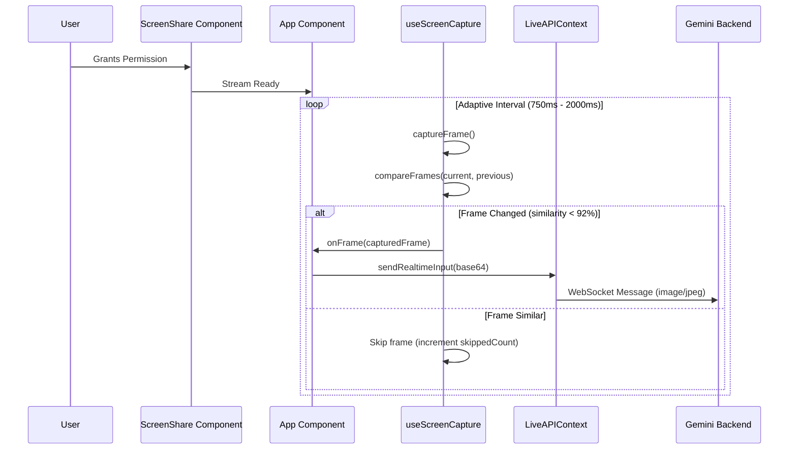

# JAN (Just Another Neuralnet) – Technical Overview

## 1. Project Overview
JAN (Just Another Neuralnet) is a React-based web application designed to act as an intelligent overlay on top of your screen. It leverages the **Gemini Multimodal Live API** to provide real-time, multimodal interaction (voice, text, video) with an awareness of the user's screen content. The agent functions as a "pair programmer" or creative assistant, capable of seeing what you see, chatting, generating images (Nano Banana), creating videos (Veo), and managing a knowledge base of uploaded documents.

## 2. Technical Stack
*   **Frontend Framework:** React 19 (Vite)
*   **Language:** TypeScript
*   **AI Integration:**
    *   **@google/genai:** Gemini API SDK for Multimodal Live interaction.
    *   **Gemini 2.5 Flash:** Standard chat and reasoning.
    *   **Nano Banana:** Text-to-Image generation.
    *   **Veo:** Text-to-Video generation.
*   **State Management:** React Context API (`LiveAPIContext`, `DocumentContext`).
*   **Styling:** Tailwind CSS (implied by class names) / Custom CSS variables.
*   **Icons:** Lucide React.
*   **Markdown Rendering:** react-markdown.
*   **UUID:** For unique message generation.

### 2.1 Documentation Map

This file (`docs/context.md`) is the **primary entrypoint** for new engineers. For deeper dives, see:

- [Architecture](./architecture.md) – System design, modules, data flows
- [Live API and Audio Pipeline](./live-api-and-audio.md) – WebSocket, audio capture/playback
- [Knowledge Base (RAG) Design](./rag-knowledge-base.md) – File Search, document lifecycle
- [UI and Interaction Guide](./ui-and-interaction.md) – ChatWidget, navigation, controls
- [Handover Runbook](./handover-runbook.md) – Operations, troubleshooting, extending
- [Deployment](./deployment.md) – GitHub/Netlify deployment details, env vars, rollback
- [Technical Debt & Roadmap](./technical-debt-roadmap.md) – Gaps, improvements, feature proposals

## 3. System Architecture

### 3.1 High-Level Architecture
The application runs entirely in the browser but connects to Google's Gemini services via WebSockets (for Live API) and REST endpoints (for other generative tasks).

```mermaid
graph TD
    User[User] -->|Interacts| App[React Application]
    App -->|Screen Capture (1 FPS)| LiveAPI[Gemini Live API (WebSocket)]
    App -->|Voice/Text| LiveAPI
    LiveAPI -->|Audio/Text Response| App
    App -->|Text Prompt| GeminiFlash[Gemini 2.5 Flash (REST)]
    App -->|Text Prompt| NanoBanana[Nano Banana (Image Gen)]
    App -->|Text/Image Prompt| Veo[Veo (Video Gen)]
    App -->|Uploads| FileStore[Google File Search Store]
    FileStore -->|Context| GeminiFlash
```

### 3.2 Core Components
*   **App.tsx**: The main entry point. It handles the "Vision Loop" which captures the screen at 1 FPS and streams it to the Live API when connected. It also orchestrates the layers (ScreenShare, LandingPage, ChatWidget).
*   **ScreenShare (Layer 1)**: Manages the user's video stream (`navigator.mediaDevices.getDisplayMedia`) and provides the "Snipping" functionality to capture specific regions of the screen.
*   **ChatWidget (Layer 2)**: The primary user interface. It is a floating, resizable, and draggable widget containing three main views:
    *   **Chat View:** Standard chat interface with attachment support.
    *   **Whiteboard View:** A canvas for drawing and ideation (integrates `WhiteboardPanel`).
    *   **Knowledge Base View:** Interface for managing uploaded documents (integrates `DocumentPanel`).
*   **contexts/LiveAPIContext**: A React Context provider that encapsulates the WebSocket connection to the Gemini Live API. It handles connection state, audio streaming, and receiving content.
*   **contexts/DocumentContext**: Manages the lifecycle of uploaded files and their association with Google File Search Stores for RAG (Retrieval-Augmented Generation) capabilities. Supports multiple stores, custom chunking config, document metadata, and RAG display settings.

### 3.3 Data Flow: Screen Perception
1.  User grants screen share permission.
2.  `App.tsx` uses the `useScreenCapture` hook which implements an optimized capture loop.
3.  The hook uses **frame diffing** to skip frames that are too similar (>92% similarity).
4.  **Adaptive FPS**: ~1.3 FPS during user activity, 0.5 FPS when idle (no input for 3s).
5.  Frames are converted to Base64 JPEG with configurable quality.
6.  Only changed frames are sent via WebSocket (`client.sendRealtimeInput`) to Gemini Live API.



## 4. Key Features
1.  **Real-time Screen Awareness**: The agent "sees" the user's screen with adaptive frame rates (1.3 FPS active, 0.5 FPS idle) and intelligent frame diffing to reduce bandwidth while maintaining context.
2.  **Multimodal Chat**:
    *   **Text & Voice**: Two-way communication.
    *   **Snipping Tool**: Users can crop a specific part of the screen to send as a static image context.
    *   **Image Generation**: Generate images using Nano Banana models directly in chat.
    *   **Video Generation**: Generate video animations from text or images using Veo.
3.  **Knowledge Base (RAG)**:
    *   Users can upload documents (PDF, TXT, MD, CSV) with optional custom chunking and metadata.
    *   Documents are indexed in a Google File Search Store.
    *   The agent can reference these documents during conversations.
    *   **Citations**: Responses include source citations from File Search, displayed in the chat UI.
4.  **Whiteboard**: Integrated drawing tool for visual communication or quick sketches.
5.  **Draggable & Resizable UI**: The chat widget is designed to be unobtrusive and flexible, behaving like a native OS window.

## 5. Project Structure
```
/
├── App.tsx                 # Main application logic & Screen Loop
├── components/             # UI Components
│   ├── ChatWidget.tsx      # Main floating widget container
│   ├── ScreenShare.tsx     # Video background & Snipping logic
│   ├── LandingPage.tsx     # Initial welcome screen
│   ├── DocumentPanel.tsx   # Knowledge Base management UI
│   └── WhiteboardPanel.tsx # Drawing canvas UI
├── contexts/               # State Management
│   ├── LiveAPIContext.tsx  # Gemini Live API WebSocket handler
│   └── DocumentContext.tsx # File upload & Store management
├── lib/                    # Utilities
│   ├── useScreenCapture.ts # Optimized screen capture hook
│   ├── audio-recorder.ts   # Microphone capture (PCM16)
│   ├── audio-streamer.ts   # Audio playback from model
│   └── genai-live-client.ts# WebSocket wrapper for Live API
├── services/               # API Services
│   ├── geminiService.ts    # REST API calls (chat, image, video)
│   └── contextService.ts   # Unified context builder for RAG
├── types.ts                # TypeScript definitions
└── .env.local              # Configuration (API Keys)
```

## 6. Setup & Configuration
### Prerequisites
*   Node.js
*   Google Gemini API Key

### Environment Variables
Create a `.env.local` file in the root directory:
```bash
GEMINI_API_KEY=your_api_key_here
```
*Note: The application reads `process.env.API_KEY` at runtime; the build tooling maps this from `GEMINI_API_KEY` in `.env.local`.*

### Installation & Run
1.  Install dependencies:
    ```bash
    npm install
    ```
2.  Start the development server:
    ```bash
    npm run dev
    ```

## 7. Development Guidelines
*   **State**: Use `LiveAPIContext` for anything related to the active AI session (connection, audio, real-time input).
*   **Styling**: The project uses CSS variables for theming (e.g., `var(--c-bacPri)`). Ensure any new components adhere to this theme system for consistency.
*   **Async Operations**: All API calls should be handled in `services/` or within Context actions to keep components clean.

## 8. Future Improvements / Technical Debt

For the complete technical debt analysis and feature roadmap, see [technical-debt-roadmap.md](./technical-debt-roadmap.md).

**High Priority:**
*   **WebSocket Auto-Reconnect**: Implement exponential backoff reconnection for Live API.
*   **State Persistence**: Persist documents and conversation history across page reloads.
*   **Veo Progress Feedback**: Show polling status during video generation.

**Medium Priority:**
*   **Memory Management**: Virtual message list, image compression, canvas cleanup.
*   **Enhanced Error States**: Retry buttons, detailed error messages, connection banners.
*   **Keyboard Shortcuts**: `Cmd+Enter` send, `Cmd+K` search, `Esc` minimize.

**Proposed Features:**
*   Conversation export/import
*   Advanced RAG UI (folders, search, bulk operations)
*   Collaboration features (shared whiteboards, team stores)
